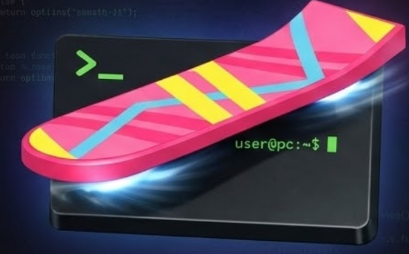

# Tor IWA — Tor Hidden Service in Your Browser

A fully functional Tor hidden service running inside a Chrome Isolated Web App (IWA). Tor is compiled to WebAssembly. The hidden service listens on a real TCP socket via the Direct Sockets API. Six WebMCP tools let AI agents operate the hidden service — fetch .onion sites, open peer connections, manage access control, and verify service identities.



## What It Does

1. **Runs Tor in your browser** — The Tor binary is compiled to WASM and boots inside the IWA. It connects to the real Tor network, builds circuits, and bootstraps to 100%.

2. **Serves a hidden service** — A `TCPServerSocket` listens on `127.0.0.1:8080`. Tor advertises a `.onion` address. Anyone on the Tor network can reach your hidden service.

3. **AI agents can operate it** — Six tools are registered via `navigator.modelContext` (WebMCP). An AI agent can fetch .onion URLs through your Tor circuit, open peer-to-peer connections to other hidden services, manage who can access your service, and verify service identities with TOFU certificates.

## How to Set Up Chrome (Step by Step)

### Step 1: Get Chrome Canary

Download Chrome Canary from [google.com/chrome/canary](https://www.google.com/chrome/canary/). This is a special version of Chrome that has the newest features. Install it like any other app.

### Step 2: Turn on the Flags

Open Chrome Canary. In the address bar at the top, type each of these one at a time, press Enter, and flip the switch to **Enabled**:

```
chrome://flags/#enable-isolated-web-apps
```
This lets Chrome load Isolated Web Apps.

```
chrome://flags/#enable-isolated-web-app-dev-mode
```
This lets you load IWAs from your own computer during development.

```
chrome://flags/#direct-sockets
```
This lets the app open real TCP connections (needed for Tor).

```
chrome://flags/#enable-web-mcp
```
This lets AI agents use the tools the app registers.

After enabling all four flags, Chrome will ask you to **Relaunch**. Click the button.

### Step 3: Build the WASM Binary

You need the Tor WASM binary (`tor.js` and `tor.wasm`). If you have the Emscripten toolchain:

```bash
# From the repo root (adjust paths to your Tor source)
emcc tor-src/src/or/main.c ... -o iwa/public/tor.js \
  -s WASM=1 -s MODULARIZE=0 -s EXPORT_ES6=0 \
  -s ALLOW_MEMORY_GROWTH=1 \
  -s EXPORTED_FUNCTIONS='["_main"]'
```

Or download a prebuilt `tor.js` + `tor.wasm` and place them in `iwa/public/`.

### Step 4: Load the IWA

1. Open Chrome Canary
2. Go to `chrome://web-app-internals`
3. Under **Install IWA from Dev Mode Proxy**, type:
   ```
   http://localhost:8080
   ```
4. But first, you need to serve the files. Open a terminal and run:
   ```bash
   cd iwa/public
   python3 -m http.server 8080
   ```
   (Or use any static file server — `npx serve`, `php -S localhost:8080`, etc.)
5. Go back to Chrome and click **Install**
6. The IWA will open in its own window with a purple title bar

### Step 5: Use It

1. Click **Start Tor** — wait for bootstrap to reach 100%
2. Click **Start Service** — a `.onion` address appears
3. Click **Register 6 Tools** — WebMCP tools become available to AI agents

That's it. You're running a Tor hidden service inside your browser.

## The 6 WebMCP Tools

| Tool | What It Does |
|------|-------------|
| `fetchOnion` | Fetches a `.onion` URL through your Tor circuit. The AI gets anonymous web access to `.onion` sites it couldn't reach otherwise. Returns HTTP response + TOFU cert verification. |
| `holepunch` | Opens a direct TCP connection to another `.onion` service via SOCKS5. Supports `connect` / `send` / `receive` / `close` actions for bidirectional peer-to-peer messaging over Tor. |
| `validateOnionCert` | Trust-on-first-use certificate management. Auto-captures service fingerprints on every fetch. Detects identity changes that may indicate compromise. |
| `manageTrustedClients` | Controls who can access your hidden service. When active, the HS rejects requests without a valid `X-Client-ID` header. Supports Ed25519 signature verification. |
| `listHolepunchSessions` | Lists all peer connections with status, message counts, and byte statistics. |
| `getServiceStatus` | Returns comprehensive HS status: uptime, request stats, access control state, cert store health, active peer sessions. |

## Architecture

```
┌─────────────────────────────────────────────┐
│  Chrome IWA Window                          │
│                                             │
│  ┌──────────┐  ┌────────────┐               │
│  │ Tor WASM │  │ UI (Preact)│               │
│  │ (tor.js) │  │ (app.mjs)  │               │
│  └────┬─────┘  └─────┬──────┘               │
│       │               │                     │
│  ┌────▼─────┐  ┌──────▼──────┐              │
│  │ SOCKS5   │  │  WebMCP     │              │
│  │ :9050    │  │  6 tools    │              │
│  └────┬─────┘  └──────┬──────┘              │
│       │               │                     │
│  ┌────▼───────────────▼──────┐              │
│  │     Direct Sockets API    │              │
│  │  TCPSocket + TCPServer    │              │
│  └────┬──────────────────────┘              │
│       │                                     │
│  ┌────▼─────┐                               │
│  │ HS :8080 │ ← Tor routes .onion traffic   │
│  └──────────┘                               │
└─────────────────────────────────────────────┘
```

**Key connections:**
- `tor-fetch.mjs` — SOCKS5 client for outbound `.onion` fetches + `TCPServerSocket` for inbound HS connections
- `webmcp.mjs` — Registers 6 tools with `navigator.modelContext`, wires shared state (trusted clients, cert store, holepunch sessions) between tools and the HS handler
- `app.mjs` — Preact UI with live dashboards, canvas visualizations, and event listeners for tool activity

## Browser APIs Used

- **Direct Sockets** (`TCPSocket`, `TCPServerSocket`) — Real TCP connections for Tor SOCKS5 and HS listener
- **WebMCP** (`navigator.modelContext.registerTool`) — Exposes tools to AI agents
- **Web Crypto** (Ed25519, AES-GCM, ECDH, SHA-256) — Key generation, .onion derivation, client auth, OHTTP framing
- **OPFS** (`navigator.storage.getDirectory`) — Persists HS keypair so .onion address survives reloads
- **Web Locks** (`navigator.locks`) — Prevents multiple tabs from binding the same HS port
- **File System Access** (`showDirectoryPicker`) — Optional persistent storage for Tor data
- **Service Worker** — Offline caching of app assets
- **View Transitions** — Smooth UI state changes
- **Share Target** — Receive URLs from the OS share sheet
- **Protocol Handler** — Register `web+tor://` URL scheme
- **Trusted Types** — CSP compliance required by IWA context

## Files

```
iwa/public/
  index.html              — Shell HTML with meta/OG tags
  app.mjs                 — UI (Preact + htm, no build step)
  app.css                 — Styles
  tor-fetch.mjs           — SOCKS5 client, HS listener, fetchOnion
  webmcp.mjs              — 6 WebMCP tool implementations
  sw.js                   — Service worker
  icon-192.png            — App icon
  icon-512.png            — App icon (large)
  og-image.png            — Social sharing image
  .well-known/manifest.webmanifest — IWA manifest with webmcp.tools
  lib/                    — Preact, preact-hooks, htm (vendored)
```

## License

MIT
